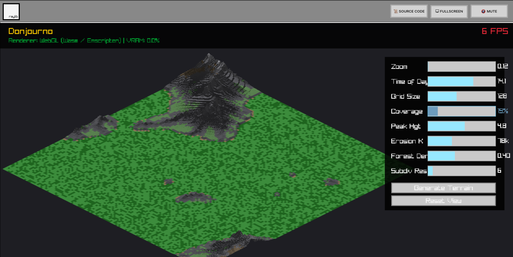
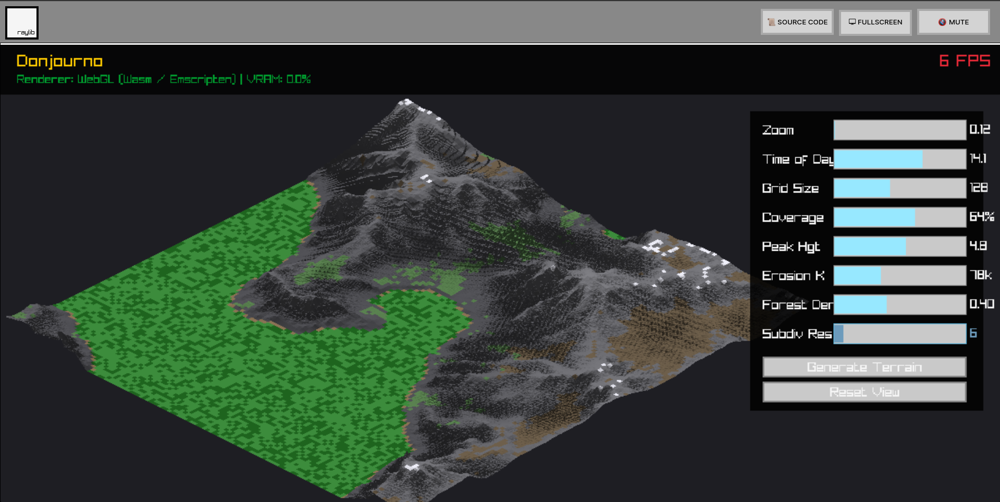
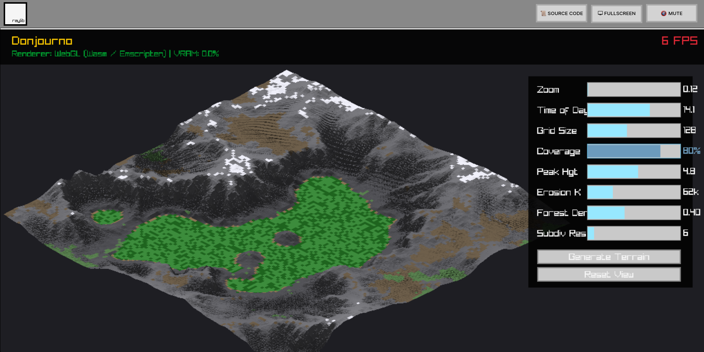
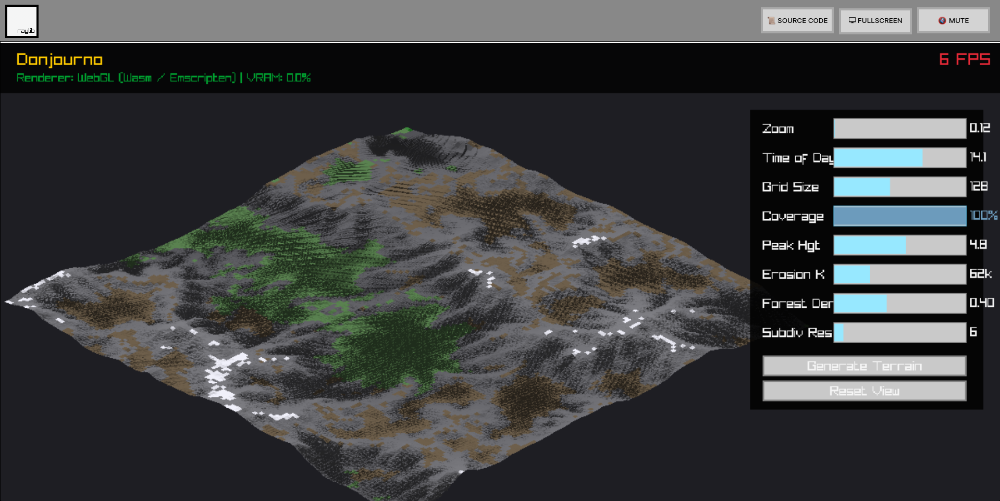

# Donjourno

**Donjourno** is a procedural terrain generator and renderer with WASM target support. It uses a layered architecture with a variadic template `Pipeline` that provides type-safe, compile-time composition of generation stages with lazy evaluation utilizing C++23 features (concepts, fold expressions, and variadic templates). The renderer supports real-time isometric 3D visualization with dynamic lighting, sub-grid tessellation, and procedural mesh texturing.

## Architecture: The Layered Approach

### 1. The Grid (Data)

The `Grid` is the central data structure representing the terrain. Each `Cell` contains:

- `height`: Elevation value (0.0 at sea level, scaled by peak height).
- `roughness`: Surface roughness generated by thermal erosion and ridge formation. Controls the amplitude of procedural mesh jitter during rendering.
- `forest_mask`: Probability or density mask for vegetation placement.
- `terrain`: Terrain classification (`Grass`, `Mountain`, `Tree`, `Water`).
- `r`, `g`, `b`: Surface color computed by the texturing pass.

### 2. Generator Layers (Logic)

A **Layer** is any struct that satisfies the `GeneratorLayer` concept. This requires two methods:

- `apply(Grid& grid)`: Performs the transformation.
- `get_name()`: Returns a string identifier for debugging/logging.

### 3. Static Pipeline (Composition)

The `Pipeline` is a variadic template that composes multiple layers. It uses C++17 fold expressions and `std::apply` to iterate over layers at compile-time, ensuring zero-cost abstraction and short-circuiting error handling.

## Generation Pipeline

The terrain is generated through a multi-stage pipeline executed in order:

```
HybridTerrain → ForestMask → ForestPlacement → TerrainTexture
```

### 1. Hybrid Terrain Generation

A coverage-controlled terrain layer that combines a **noise-based allocation mask** with **Newtonian hydraulic erosion**. Mountain regions emerge in organic, random shapes determined by the coverage percentage, while remaining terrain stays flat and walkable — designed for procedural cities, roads, and grid-based tabletop RPG play.

The implementation follows the Newtonian droplet model from [SimpleErosion](https://github.com/weigert/SimpleErosion).

#### Phase 1 — Noise-Based Coverage Mask

A low-frequency 2D noise field determines which parts of the map become mountainous. The mask uses 4-octave `fbm_2d` at a coarse scale ($s_{mask} = 0.015$) to produce large, continent-like regions:

$$m(x, y) = \text{fbm}_2(x \cdot s_{mask}, y \cdot s_{mask})$$

To allocate exactly the desired **coverage percentage** of cells, all noise values are sorted and a threshold $\tau$ is selected such that:

$$\tau = \text{sorted}[N_{total} - N_{target}], \quad N_{target} = N_{total} \cdot \text{coverage}$$

Cells where $m(x, y) \geq \tau$ become the **mountain pool**. This produces irregular, natural-looking boundaries without explicit ellipse or circle placement. At 100% coverage the entire map is mountainous; at 25% roughly a quarter gets allocated in random organic patches.

#### Phase 2 — Heightmap Within Coverage Mask

A 6-octave fBm heightmap is generated **only inside the mask** using a hash-based value noise function (zero dependencies):

$$h(x, y) = H_{peak} \cdot \text{clamp}\left(\text{fbm}_2(x \cdot s, y \cdot s) \cdot 1.3 - 0.15, \, 0, \, 1\right) \cdot \beta(x, y)$$

where the **edge blend** $\beta$ provides a smooth cosine transition at pool boundaries based on the noise depth above the threshold:

$$\beta = \text{clamp}\left(\frac{m(x, y) - \tau}{\Delta_{blend}}, \, 0, \, 1\right), \quad \Delta_{blend} = 0.05$$

The noise scale $s$ is auto-computed from the effective pool radius ($r_{eff} = \sqrt{N_{target} / \pi}$) so feature size adapts to coverage area. All cells outside the mask remain at height 0.

#### Phase 3 — Newtonian Droplet Erosion

Water droplets spawn **only within mask cells** and are simulated with Newtonian physics. Each droplet has:

- **Position** $(p_x, p_y)$ — grid coordinates
- **Velocity** $(s_x, s_y)$ — 2D speed vector
- **Volume** $V$ — water quantity, decreasing via evaporation
- **Sediment** $S$ — carried material

At each timestep $\Delta t$:

**1. Surface normal acceleration.** The droplet is accelerated by the terrain's surface normal, weighted by its mass:

$$\vec{s} \mathrel{+}= \frac{\Delta t \cdot \hat{n}_{xz}}{V \cdot \rho}$$

where $\hat{n}_{xz}$ is the horizontal component of the surface normal (computed via central differences) and $\rho$ is the droplet density.

**2. Friction damping.** Speed is reduced each step:

$$\vec{s} \mathrel{\times}= (1 - \Delta t \cdot f)$$

**3. Unified erosion/deposition.** Sediment capacity is proportional to speed, volume, and height differential:

$$C_{max} = V \cdot |\vec{s}| \cdot \max(h_{old} - h_{new}, \, 0)$$

Both erosion and deposition use a single formula that approaches equilibrium:

$$S \mathrel{+}= \Delta t \cdot D \cdot (C_{max} - S)$$
$$h(p) \mathrel{-}= \Delta t \cdot V \cdot D \cdot (C_{max} - S)$$

When $C_{max} > S$, the droplet erodes (picks up sediment). When $C_{max} < S$, it deposits. This unified approach produces smoother sediment redistribution than separate erosion/deposition branches.

**4. Boundary kill.** Droplets that leave the coverage mask are immediately killed, preventing erosion from spilling into flat terrain.

**5. Evaporation.** Volume decreases each step:

$$V \mathrel{\times}= (1 - \Delta t \cdot e)$$

The droplet dies when $V < V_{min}$ (default 0.01) or leaves the mask.

**Default parameters** (tuned from SimpleErosion):

| Parameter         | Default | Description                              |
| ----------------- | ------- | ---------------------------------------- |
| `dt`              | 1.2     | Integration timestep                     |
| `friction`        | 0.05    | Speed loss factor per step               |
| `density`         | 1.0     | Droplet density (mass = V × ρ)           |
| `depositionRate`  | 0.1     | Rate of approach to equilibrium sediment |
| `evaporationRate` | 0.01    | Volume loss per step                     |
| `minVolume`       | 0.01    | Volume below which droplet dies          |

#### Phase 4 — Terrain Classification

Cells within the mask with height > 0.1 are classified as `Mountain`; everything else is `Grass`. Roughness is derived from cumulative erosion activity at each cell, normalized and scaled by elevation. Flat terrain outside the coverage mask has zero height and zero roughness.

### 2. Forest Mask & Placement

The `ForestMaskGenerator` computes a fertility mask based on elevation, **excluding mountain terrain entirely** (forest_mask = 0 for all `Mountain` cells). For grass cells, the mask decays with height:

$$\text{mask} = \text{clamp}\left(1 - \left(\frac{h}{h_{limit}}\right)^{steepness}, \, 0, \, 1\right)$$

The `ForestPlacementGenerator` then stochastically places trees where `random() < mask × density`.

### 3. Terrain Texturing (Colouring Rules)

The `TerrainTextureGenerator` uses **relative height thresholds** (computed from the actual max height) so coloring adapts to any terrain configuration:

| Condition                                     | Colour         | RGB               |
| --------------------------------------------- | -------------- | ----------------- |
| **Mountain** — flat, $h_{rel} > 0.75$         | Snow           | `(240, 240, 250)` |
| **Mountain** — steep slope                    | Grey rock      | `(80–130, grey)`  |
| **Mountain** — flat, $h_{rel} > 0.4$          | Brown rock     | `(110, 95, 75)`   |
| **Mountain** — flat, low altitude             | Highland grass | `(90, 130, 80)`   |
| **Tree**                                      | Dark green     | `(30, 100, 30)`   |
| **Grass** — steep ($\text{steepness} > 0.08$) | Dirt           | `(139, 115, 85)`  |
| **Grass** — flat                              | Green          | `(60, 140, 60)`   |

Steepness is computed per-cell using central differences. Grey rock colour is **altitude-dependent** — darker at lower elevations, lighter near peaks.

## Rendering Pipeline

### Isometric Projection

$$s_x = (x - y) \cdot 32, \quad s_y = (x + y) \cdot 16 - h \cdot 80$$

### Sub-Grid Tessellation

Each grid cell is subdivided into $N \times N$ micro-quads (controlled by the **"Subdiv Res"** slider, 1–64). Vertex heights are computed via bilinear interpolation of the four surrounding cell corners.

### Procedural Roughness Overlay

Each sub-vertex receives procedural height jitter driven by erosion-derived `roughness` and elevation:

$$h' = h + (\text{hash}(x, y) - 0.5) \cdot \text{clamp}(h \cdot 1.5, 0, 1) \cdot \text{roughness}$$

### Dynamic Lighting

Per-triangle normals are dot-producted with a sun direction vector (controlled by "Time of Day", 6:00–18:00):

$$I = \text{clamp}(0.35 + 0.8 \cdot \max(\hat{n} \cdot \hat{L}, 0), 0, 1)$$

### Geometry Caching

All tessellation, noise, normal, and lighting calculations are cached in `std::vector<CachedTriangle>`. The cache is invalidated only when UI parameters change, reducing per-frame cost to a simple `DrawTriangle` iteration.

## Usage

### Building

The project uses a recursive Make system. It requires a Clang toolchain (LLVM 18+) for native builds, and Emscripten for WebAssembly.

**Native Targets:**

```bash
make clean
make cli   # Builds bin/Donjourno-cli
make gui   # Builds bin/Donjourno-gui
make       # Builds both cli and gui
```

**WebAssembly Target:**

```bash
make setup-wasm # Bootstraps the local Emscripten sandbox and Python 3.11
make wasm       # Builds the WebAssembly app to build-wasm/
```

### Running

**Native:**

```bash
make run            # Runs the GUI app
./bin/Donjourno-cli # Runs the CLI app
```

**Web:**

```bash
make serve # Starts a local server on port 8080 to host the Wasm build
```

## Example Composition

```cpp
auto pipeline = Pipeline(
    HybridTerrainGenerator{},                               // Coverage mask + fBm + droplet erosion
    ForestMaskGenerator{0.6f, 2.0f},                        // Create fertility mask
    ForestPlacementGenerator{0.4f},                         // Stochastic planting
    TerrainTextureGenerator{}                               // Assign colours by biome
);
pipeline.execute(grid);
```

## Example GUI mode output








