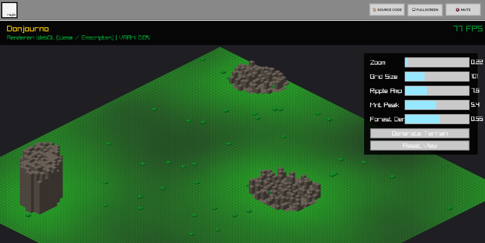

# Donjourno

**Donjourno** is a high-performance, statically-linked C++23 surface generator designed for creating complex, layered dungeone maps. It uses an architecture of layer which provides composition API through variadic template `Pipeline` that allows for type-safe, compile-time composition of generation layers with lazy evaluation.

## Architecture: The Layered Approach

The project is built on three core pillars that enable highly flexible map generation:

### 1. The Grid (Data)

The `Grid` is the central data structure representing the map. Each `Cell` contains:

- `height`: Normalized elevation (0.0 to 1.0).
- `forest_mask`: Probability or density mask for vegetation.
- `terrain`: Visual representation (`Grass`, `Mountain`, `Tree`, `Water`).

### 2. Generator Layers (Logic)

A **Layer** is any struct that satisfies the `GeneratorLayer` concept. This requires two methods:

- `apply(Grid& grid)`: Performs the transformation.
- `get_name()`: Returns a string identifier for debugging/logging.

### 3. Static Pipeline (Composition)

The `Pipeline` is a variadic template that composes multiple layers. It uses C++17 fold expressions and `std::apply` to iterate over layers at compile-time, ensuring zero-cost abstraction and short-circuiting error handling.

## Generation Formulas

Each layer uses specific mathematical models to transform the grid:

### Landscape Generation

Uses a radial sine-wave distance field to create organic, island-like or cave-like formations.
$$height = \text{clamp}(0.5 + 0.5 \cdot \sin(\text{distance} + \text{frequency}), 0, 1)$$
where `distance` is the normalized Euclidean distance from the center of the grid.

### Mountain Ridge Generation

Creates a prominent mountain ridge using a continuous sine wave for the spine and radial falloff for the sides. The base formula for height is:

$$\text{height} = \text{clamp}(H_{peak} \cdot \cos^P\left(\frac{d}{\Delta x}\pi\right) + \text{noise}, 0, 1)$$

Where:

- $H_{peak}$ is the maximum `peak_height` (e.g., 3.0).
- $P$ is the `falloff_power` (e.g., 2.5), controlling the steepness of the slope.
- $\Delta x$ is the `noise_amplitude` (e.g., 8.0), determining the width of the ridge.
- $\text{noise}$ is Perlin noise applied along the ridge for natural waviness.
- $d$ is the shortest distance from a cell to the central spine.

This creates a central "spine" of high elevation that tapers off sharply, simulating a real mountain range.

### Forest Masking

Calculates where trees _could_ grow based on elevation. It uses a non-linear decay curve controlled by a steepness parameter.

$$
\text{forestmask} =
\begin{cases}
    0.5 & \text{if } height > limit \\
    \text{clamp}(1.0 - (\frac{height}{limit})^{steepness}, 0, 1) & \text{otherwise}
\end{cases}
$$

Where:

- `limit`: The height threshold where the primary forest ends.
- `steepness`: Power exponent ($1.0$ is linear, $>1.0$ is faster decay/clearer valleys, $<1.0$ is slower decay).

### Gaussian Seeding

A localized strategy for creating high-density groves at specific coordinates. This layer refines the existing `forestmask` by multiplying it with a multivariate Gaussian distribution.

$$\text{weight} = \sum_{s \in seeds} s.amp \cdot \exp\left(-\left(\frac{(x - s.x)^2}{2 \cdot s.sx^2} + \frac{(y - s.y)^2}{2 \cdot s.sy^2}\right)\right)$$

$$\text{forestmask} = \text{clamp}(\text{forestmask} \cdot \text{weight}, 0, 1)$$

### Forest Planting

A stochastic layer that transforms the mask into actual tree placements using a noise-based probability check.

$$\text{istree} = \text{random}(0, 1) < (\text{forestmask} \cdot \text{density})$$

## Usage

### Building

The project uses a recursive Make system. You can build the entire project or specific targets. It requires a Clang toolchain (LLVM 18+) or higher for native builds, and Emscripten (https://github.com/emscripten-core/emscripten) for WebAssembly build.

**Native Targets:**

```bash
make clean
make cli   # Builds bin/Donjourno-cli
make gui   # Builds bin/Donjourno-gui
make       # Builds both cli and gui
```

**WebAssembly Target:**

```bash
make setup-wasm # Bootstraps the local Emscripten sandbox and Python 3.11
make wasm       # Builds the WebAssembly app to build-wasm/
```

### Running

**Native:**

```bash
make run            # Runs the GUI app
./bin/Donjourno-cli # Runs the CLI app
```

**Web:**

```bash
make serve # Starts a local Bun server on port 8080 to host the Wasm build
```

## Example Composition

```cpp
auto pipeline = Pipeline(
    RippleTerrainGenerator{5.0f},                       // Create landmass
    ForestMaskGenerator{0.6f, 2.0f},                    // Create fertility mask (limit, steepness)
    GaussianForestSeeder{ {20, 100, 15.0, 15.0, 1.8} }, // Add specific groves
    ForestPlacementGenerator{0.5f}                      // Stochastic planting
);
pipeline.execute(grid);
```

## Example GUI mode output



## Example CLI mode output

```
--- Executing Static Pipeline ---
[WORK] RippleTerrainGenerator creating base landmass...
Layer RippleTerrainGenerator executed successfully
[WORK] ForestMaskGeneratorSteep calculating fertile areas...
Layer ForestMaskGeneratorSteep executed successfully
[WORK] GaussianForestSeeder clusters applying...
Layer GaussianClustering executed successfully
[WORK] ForestPlacementGenerator planting trees stochastically...
Layer ForestPlacementGenerator executed successfully
.............^^^^^^^^^^^^^^^^^^^^^^^^^^^^^^^^^^^^^..................................................
.............^^^^^^^^^^^^^^^^^^^^^^^^^^^^^^^^^^^^^..................................................
.............^^^^^^^^^^^^^^^^^^^^^^^^^^^^^^^^^^^^^..................................................
..............^^^^^^^^^^^^^^^^^^^^^^^^^^^^^^^^^^^^..................................................
..............^^^^^^^^^^^^^^^^^^^^^^^^^^^^^^^^^^^^..................................................
..............^^^^^^^^^^^^^^^^^^^^^^^^^^^^^^^^^^^^..................................................
..............^^^^^^^^^^^^^^^^^^^^^^^^^^^^^^^^^^^^..................................................
..............^^^^^^^^^^^^^^^^^^^^^^^^^^^^^^^^^^^...................................................
...............^^^^^^^^^^^^^^^^^^^^^^^^^^^^^^^^^^...................................................
...............^^^^^^^^^^^^^^^^^^^^^^^^^^^^^^^^^^...................................................
................^^^^^^^^^^^^^^^^^^^^^^^^^^^^^^^^....................................................
................^^^^^^^^^^^^^^^^^^^^^^^^^^^^^^^^....................................................
.................^^^^^^^^^^^^^^^^^^^^^^^^^^^^^^.....................................................
..................^^^^^^^^^^^^^^^^^^^^^^^^^^^^......................................................
...................^^^^^^^^^^^^^^^^^^^^^^^^^^.......................................................
....................^^^^^^^^^^^^^^^^^^^^^^^^........................................................
.....................^^^^^^^^^^^^^^^^^^^^^^.........................................................
.......................^^^^^^^^^^^^^^^^^^...........................................................
...........................^^^^^^^^^^...............................................................
....................................................................................................
....................................................................................................
....................................................................................................
....................................................................................................
....................................................................................................
....................................................................................................
....................................................................................................
....................................................................................................
....................................................................................................
....................................................................................................
....................................................................................................
....................................................................................................
....................................................................................................
....................................................................................................
....................................................................................................
....................................................................................................
....................................................................................................
....................................................................................................
....................................................................................................
....................................................................................................
....................................................................................................
....................................................................................................
....................................................................................................
...........Y........................................................................................
....................................................................................................
....................................................................................................
.........................................................................................^^^^^^^^^^^
......................................................................................^^^^^^^^^^^^^^
....................................................................................^^^^^^^^^^^^^^^^
..................................................................................^^^^^^^^^^^^^^^^^^
.................................................................................^^^^^^^^^^^^^^^^^^^
................................................................................^^^^^^^^^^^^^^^^^^^^
...............................................................................^^^^^^^^^^^^^^^^^^^^^
...............................................................................^^^^^^^^^^^^^^^^^^^^^
..............................................................................^^^^^^^^^^^^^^^^^^^^^^
..............................................................................^^^^^^^^^^^^^^^^^^^^^^
..............Y........Y.....................................................^^^^^^^^^^^^^^^^^^^^^^^
.............................................................................^^^^^^^^^^^^^^^^^^^^^^^
.............................................................................^^^^^^^^^^^^^^^^^^^^^^^
.............................................................................^^^^^^^^^^^^^^^^^^^^^^^
............................................................................^^^^^^^^^^^^^^^^^^^^^^^^
..........Y.................................................................^^^^^^^^^^^^^^^^^^^^^^^^
............................................................................^^^^^^^^^^^^^^^^^^^^^^^^
.............Y...............Y..............................................^^^^^^^^^^^^^^^^^^^^^^^^
............................................................................^^^^^^^^^^^^^^^^^^^^^^^^
.........Y..................................................................^^^^^^^^^^^^^^^^^^^^^^^^
.............................Y..............................................^^^^^^^^^^^^^^^^^^^^^^^^
....................Y.....Y.................................................^^^^^^^^^^^^^^^^^^^^^^^^
.............................................................................^^^^^^^^^^^^^^^^^^^^^^^
......Y.Y..........Y...............Y.........................................^^^^^^^^^^^^^^^^^^^^^^^
.........Y..........Y.........Y..............................................^^^^^^^^^^^^^^^^^^^^^^^
..............Y..............................................................^^^^^^^^^^^^^^^^^^^^^^^
...............Y.Y............................Y...............................^^^^^^^^^^^^^^^^^^^^^^
.Y........Y........Y...Y.Y..Y.........Y.......................................^^^^^^^^^^^^^^^^^^^^^^
..............Y......Y...YY..Y................................................^^^^^^^^^^^^^^^^^^^^^^
..Y.............YY..Y...Y........Y................Y............................^^^^^^^^^^^^^^^^^^^^^
......Y.Y..Y.....................Y...Y......Y...................................^^^^^^^^^^^^^^^^^^^^
.....Y......Y................Y....Y......Y.......................................^^^^^^^^^^^^^^^^^^^
..Y...Y....Y.Y.........YY.....Y.Y.YY..............................................^^^^^^^^^^^^^^^^^^
...Y..Y........Y.........Y..Y...YY...Y.............................................^^^^^^^^^^^^^^^^^
...........Y..Y...Y.YY.Y.Y...................Y......................................^^^^^^^^^^^^^^^^
...Y.Y..Y.YYYY.Y.Y.Y.YY..YY.YY...........Y........Y....................................^^^^^^^^^^^^^
........Y.Y.Y...YYY.YY.Y......Y...Y..Y..............Y.....................................^^^^^^^^^.
........Y.......Y..Y......YY..Y...YY...YY...........................................................
Y...........Y.....Y..YYYY...Y........Y.Y............................................................
...Y..Y.....YY..Y..YYY.YY...........Y...............................................................
.Y...........Y..Y...Y...YYY.....Y..Y.Y..Y...........................................................
Y......Y..Y.YY.Y.............Y.....Y................................................................
........YY.Y.Y.Y..Y...Y.YY...Y..Y..Y.................Y...Y..........................................
..Y...YY..Y....Y.......Y..YY......Y......Y..........................................................
......YY.Y.....Y.YYY........Y.Y.Y.Y.YYY........Y....................................................
......Y....Y...YY..Y.YY.YYY.......Y.Y.Y..Y..........................................................
.......Y..Y.....YYY.Y.....Y..Y......Y..Y...........Y................................................
.....YY....Y....Y.......YY...Y...Y.......Y...Y......................................................
.......Y.....Y....YY....Y.Y..Y..YY........Y.........................................................
......Y.....Y.Y...........Y....Y....................................................................
Y...Y............Y...Y...Y.Y.................YY........Y............................................
.....Y..................Y..Y.....Y..................................................................
..............Y....Y......YY........................................................................
...Y.Y.........Y..Y.................................................................................
..Y.....Y...Y........Y.Y..YYY.............Y.........................................................
```
